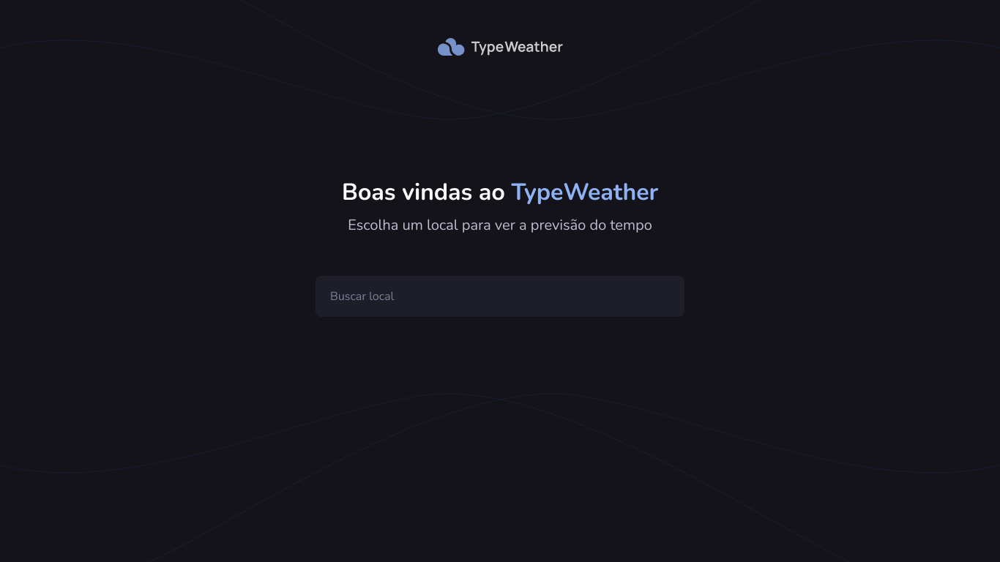
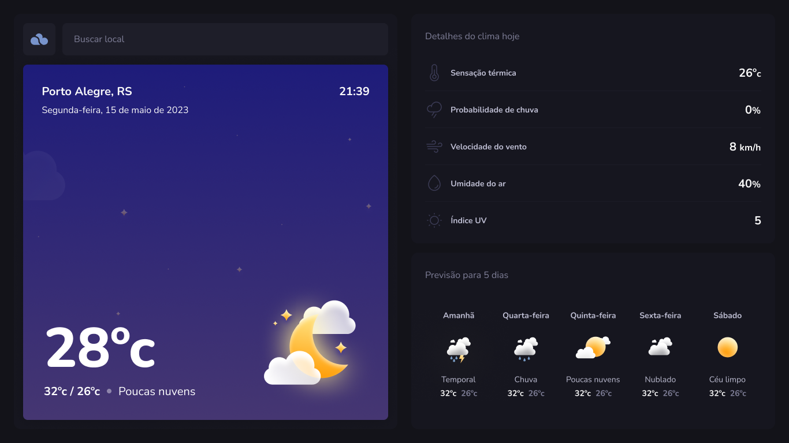

<h1 align="center">TypeWeather ⛅ </h1>

This is a bonus project for Rocketseat's explorer certificates, a weather forecasting application that has been converted from JavaScript (JS) to TypeScript (TS). The main goal of this conversion is to enhance the code's robustness, scalability, and maintainability, taking advantage of the benefits offered by TypeScript.

 

## ⛅ About

TypeWeather is a weather forecasting application that provides essential information to plan your day. With an intuitive and visually appealing interface, the app delivers crucial weather details including the current temperature, forecasted minimum and maximum temperatures, chance of rain, wind speed, humidity, UV index, and a comprehensive 5-day weather forecast. Make use of the forecast accuracy to make informed decisions and be prepared for any weather condition.

 

## 🧪 Tools

- [TypeScript](https://www.typescriptlang.org/)
- [React](https://react.dev/)
- [Vite](https://vitejs.dev/)

 

## 🚀 Deploy

You can access the project through [this link](https://typeweather-lu.netlify.app/)

 

---

Developed with ❤️ by <a href="https://www.linkedin.com/in/lubernardino/" target="_blank">Luana Bernardino</a>

